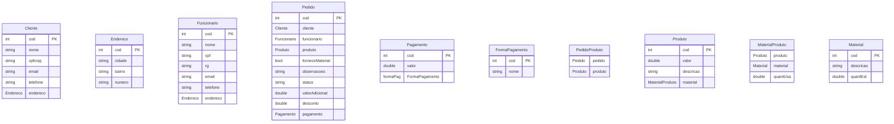

## Modelo conceitual

```mermaid
    erDiagram

    Cliente {
        int cod PK
        string nome
        string cpfcnpj
        string email
        string telefone
        Endereco endereco
    }

   Endereco {
      int cod PK
      string cidade
      string bairro
      string numero
   }

   Funcionario {
      int cod PK
      string nome
      string cpf
      string rg
      string email
      string telefone
      Endereco endereco
   }

   Pedido {
      int cod PK
      Cliente cliente
      Funcionario funcionario
      Produto produto
      bool forneceMaterial
      string observacoes
      string status
      double valorAdicional
      double desconto
      Pagamento pagamento
   }

   Pagamento {
      int cod PK
      double valor
      formaPag FormaPagamento
   }

   FormaPagamento {
      int cod PK
      string nome
   }

   PedidoProduto {
      Pedido pedido
      Produto produto
   }

   Produto {
      int cod PK
      double valor
      string descricao
      MaterialProduto material
   }

   MaterialProduto {
      Produto produto
      Material material
      double quantUsa
   }

   Material{
      int cod PK
      string descricao
      double quantEst
   }

```
