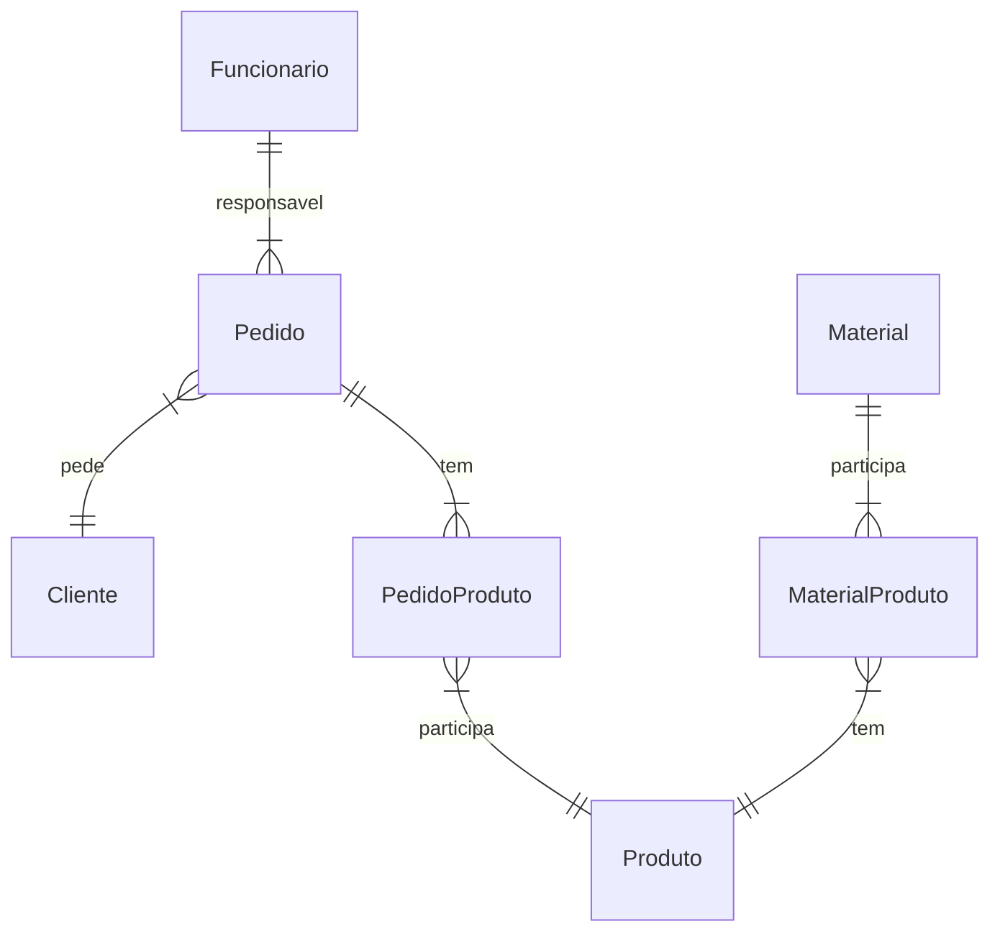

### Histórico de revisões
| Data       | Versão  | Descrição                          | Autor                          |
| :--------- | :-----: | :--------------------------------: | :----------------------------- |
| 16/04/2024 | 1.0     | Contagem indicativa | Victor |

### Descrição

Análise dos pontos de função usando contagem indicativa.

### Modelo de Dados

### Contagem indicativa

| Função de Dado         | Entidades Relacionadas   | Tamanho em PF |
| :---------------:      | :----------------------: | :-----------: |
| ALI US01 - Pedido      | Pedido                   | 50 PF         |
| ALI US02 - Cliente     | Cliente                  | 35 PF         |
| ALI US03 - Material    | Material                 | 35 PF         |
| ALI US04 - Funcionario | Funcionario              | 35 PF         |
| ALI US05 - Produto     | Produto                  | 50 PF         |
| **Total**              | **Ci**                   | **205 PF**    |
