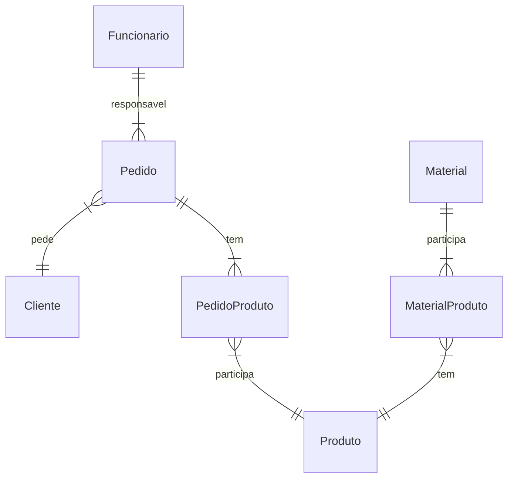

# Modelo de dados

## Dicionário de Dados:

|   Tabela   | Cliente |
| ---------- | ----------- |
| Descrição  | Armazena as informações de um cliente. |

|  Nome         | Descrição                        | Tipo de Dado | Tamanho | Restrições de Domínio |
| ------------- | -------------------------------- | ------------ | ------- | --------------------- |
| cod           | identificador gerado pelo SGBD   | SERIAL       | ---     | PK / Identity |
| nome          | nome do cliente                  | VARCHAR      | 150     | Not Null |
| cpfCnpj       | CPF ou CNPJ do cliente           | VARCHAR      | 14      | Unique / Not Null |
| email         | e-mail para contato do cliente   | VARCHAR      | 150     | --- |
| telefone      | telefone para contato do cliente | VARCHAR      | 20      | --- |
| endereco      | endereço do cliente              | VARCHAR      | 250     | --- |

|   Tabela   | Funcionario |
| ---------- | ----------- |
| Descrição  | Armazena as informações de um funcionário. |

|  Nome         | Descrição                                | Tipo de Dado | Tamanho | Restrições de Domínio |
| ------------- | ---------------------------------------- | ------------ | ------- | --------------------- |
| cod           | identificador gerado pelo SGBD           | SERIAL       | ---     | PK / Identity |
| nome          | nome do funcionário                      | VARCHAR      | 150     | Not Null |
| cpf           | CPF do funcionário, utilizado para login | CHAR | 11    | Unique / Not Null |
| senha         | senha utilizada para logar no sistema    | VARCHAR | 50 | Unique / Not Null |
| rg            | RG do funcionário                        | CHAR         | 10      | Unique / Not Null |
| email         | e-mail do funcionário                    | VARCHAR      | 150     | --- |
| telefone      | telefone do funcionário                  | VARCHAR      | 20      | --- |
| endereco      | endereço do funcionário                  | VARCHAR      | 250     | --- |

|   Tabela   | Pedido      |
| ---------- | ----------- |
| Descrição  | Armazena as informações de um pedido. |

|  Nome           | Descrição                                                          | Tipo de Dado | Tamanho | Restrições de Domínio |
| --------------- | ------------------------------------------------------------------ | ------------ | ------- | --------------------- |
| cod             | identificador gerado pelo SGBD                                     | SERIAL       | ---     | PK / Identity |
| codCliente      | código do cliente que realizou o pedido                            | SERIAL       | ---     | FK / Not Null |
| codFuncionario  | código do funcionário responsável pelo pedido                      | SERIAL       | ---     | FK / Not Null |
| forneceMaterial | indica se o cliente fornecerá o material para confecção do produto | BOOLEAN      | ---     | Not Null |
| observacoes     | observações adicionais sobre o pedido                              | VARCHAR      | 250     | --- |
| status          | indica o estado em que se encontra o pedido                        | CHAR         | 1       | Not Null |
| valorAdicional  | Valor adicional cobrado para o pedido                              | REAL         | ---     | Not Null |
| desconto        | Percentual de desconto para o pedido                               | REAL         | ---     | Not Null |
| formaPagamento  | Forma de pagamento utilizada para o pedido                         | VARCHAR      | 100     | Not Null |

|   Tabela   | Produto     |
| ---------- | ----------- |
| Descrição  | Armazena as informações de um produto. |

|  Nome         | Descrição                            | Tipo de Dado | Tamanho | Restrições de Domínio |
| --------------| -------------------------------------| ------------ | ------- | --------------------- |
| cod           | identificador gerado pelo SGBD       | SERIAL       | ---     | PK / Identity |
| valor         | valor unitário do produto            | REAL         | ---     | Not Null |
| descricao     | descrição do produto                 | VARCHAR      | 250     | Not Null |

|   Tabela   | Material    |
| ---------- | ----------- |
| Descrição  | Armazena as informações de um Material. |

|  Nome           | Descrição                         | Tipo de Dado | Tamanho | Restrições de Domínio |
| --------------- | --------------------------------- | ------------ | ------- | --------------------- |
| cod             | identificador gerado pelo SGBD    | SERIAL       | ---     | PK / Identity |
| descricao       | descrição do material             | VARCHAR      | 250     | Not Null      |
| quantEst        | quantidade do material em estoque | REAL         | ---     | Not Null      |

|   Tabela   | PedidoProduto |
| ---------- | ------------- |
| Descrição  | Armazena as informações de um item de um pedido |

|  Nome           | Descrição                         | Tipo de Dado | Tamanho | Restrições de Domínio |
| --------------- | --------------------------------- | ------------ | ------- | --------------------- |
| codPedido       | código do pedido relacionado      | SERIAL       | ---     | PK / FK |
| codProduto      | código do produto relacionado     | SERIAL       | ---     | PK / FK |
| quantidade      | quantidade de produtos no item    | INTEGER      | ---     | Not Null |

|   Tabela   | MaterialProduto |
| ---------- | ------------- |
| Descrição  | Armazena as informações de um material utilizado em um produto |

|  Nome           | Descrição                                          | Tipo de Dado | Tamanho | Restrições de Domínio |
| --------------- | -------------------------------------------------- | ------------ | ------- | --------------------- |
| codProduto      | código do produto relacionado                      | SERIAL       | ---     | PK / FK |
| codMaterial     | código do material relacionado                     | SERIAL       | ---     | PK / FK |
| quantUsa        | quantidade do material utilizada para o produto    | REAL         | ---     | Not Null |